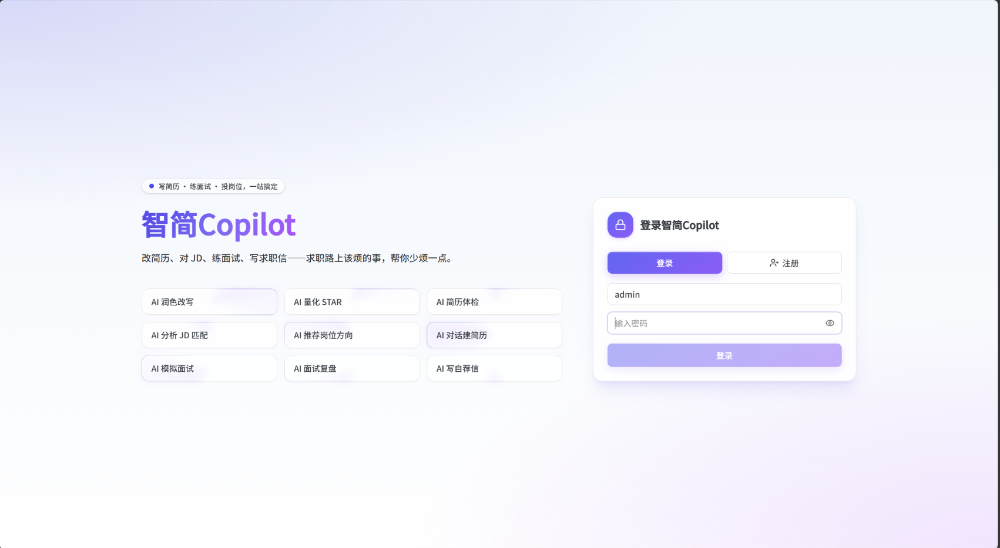

# 智简Copilot

面向大学生和刚入职场年轻人的求职准备工具。

它把写简历、对照岗位改材料、写自荐信、记录投递、模拟面试和复盘改进串在一起，不用在 Word、表格和几个 AI 聊天窗口之间来回切。

和普通「聊几句就给你一段文字」不一样，智简Copilot 更强调三件事：

- **改的是整份简历**：按模块管理教育、实习、项目、技能，AI 知道改的是哪一块，不会只吐一大段话让你自己粘贴
- **改之前先让你确认**：AI 的修改会先展示给你看，你觉得合适再采纳，不合适可以拒绝
- **改完能直接拿去用**：预览什么样，导出的 PDF 就什么样，方便投递



---

## 产品亮点

| 对比普通简历站 | 对比纯聊天 AI |
|----------------|---------------|
| 模块化结构 + 实时预览 + 多版本管理 | 直接操作简历结构，不是粘贴一大段文字 |
| JD 匹配常驻面板，可定位、可一键应用 | 修改以 diff 卡片确认，可撤销、可追踪 |
| 投递 / 面试 / 报告数据打通 | 多角色 Agent，各场景独立 prompt 与工具权限 |
| 服务端 PDF 渲染，预览即导出 | 面试前联网调研公司，面试后结构化复盘 |

---

## 功能详解

### 1. 简历中心与编辑

**入口**：欢迎页 → 我的简历（`/resumes`）

- **多份简历管理**：搜索、排序（名称 / 创建 / 更新时间）、复制、批量删除
- **模块化结构**：个人信息、求职意向、教育 / 实习 / 工作 / 项目 / 技能等模块
- **富文本编辑**（Tiptap）：字体、字号、颜色、对齐、加粗、链接等
- **布局能力**：模块拖拽排序、行列多列排版、标签、头像、主题色
- **实时预览**：左侧编辑、中间预览；导出与预览同源，避免「预览一套、PDF 另一套」
- **岗位定制版**：针对某 JD 另存定制简历，记录与母简历的关联，不覆盖原版
- **图片导入**（`/create/[id]`）：上传简历截图，Agent 识别并还原为可编辑结构，支持逐项修正
- **导出**：PDF、PNG、JPG、WEBP、SVG；PDF 优先服务端 Chromium，失败自动降级浏览器打印

**编辑器三分屏**（`/edit/[id]`）：

```
┌─────────────┬──────────────┬─────────────┐
│  模块编辑   │   实时预览   │  AI Agent   │
│  个人信息   │   简历成品   │  润色/体检  │
│  经历模块   │              │  diff 确认  │
└─────────────┴──────────────┴─────────────┘
```

---

### 2. AI Agent 体系

所有 Agent 共享同一套简历内核（`lib/resume-core`）：读取大纲、定位 `mod-` / `row-` / `el-` 级元素，通过工具提交 **ChangeSet**，界面以 **diff 卡片** 展示，用户接受 / 拒绝后才落地。

#### 编辑器内模式（三分屏右栏）

| 模式 | 做什么 |
|------|--------|
| **编辑** | 润色措辞、调整结构、增删模块与经历 |
| **校对纠错** | 错别字、语病、标点、日期格式统一（只改客观错误，不润色） |
| **排版美化** | 主题色、对齐、字号统一、模块顺序（不改正文语义） |
| **量化 & STAR** | 把流水账改成「动词 + 行动 + 可衡量结果」，追问真实数字，不编造 |

#### 独立工作区模式（Career Workspace，`/career/[mode]/[id]`）

| 模式 | 做什么 |
|------|--------|
| **创建助手** (`build`) | 对话式从零搭建简历，按规范自动分列（教育四列、工作标题行 + 要点行等） |
| **图片导入** (`imageImport`) | 多模态识别截图，`replace_resume` 生成草稿 + 逐项 diff 修正 |
| **JD 匹配** (`jd`) | 对照 JD 出匹配卡片；常驻面板展示分数、命中 / 缺失关键词、建议与 `targetIds` 定位高亮 |
| **岗位方向推荐** (`discover`) | Holland 霍兰德测验 + 简历反推 3–5 个适合方向（匹配度、理由、典型岗位、能力缺口） |
| **自荐信** (`coverLetter`) | 基于简历写自荐信 / Boss 直聘开场白，只改信件不改简历 |
| **模拟面试** (`interview`) | 见下文「模拟面试」专节 |

#### 简历体检（编辑器顶部）

两层诊断，结果可一键交给编辑 Agent 修复：

1. **本地规则体检**（零网络）：占位符残留、联系方式缺失、空模块、经历缺数字、篇幅过长等硬伤
2. **AI 体检**：HR 视角综合分、五维评分（内容完整性 / 量化成果 / 岗位匹配 / 表达清晰 / 排版样式）、亮点提炼、≤12 条可执行问题（每条带 `prompt`）

---

### 3. JD 匹配优化

**流程**：选简历 → 对话收集 JD → 进入专注工作台（左简历 · 右助手）

- **匹配面板**（常驻，非一次性聊天）：匹配度分数、已命中 / 缺失关键词、逐条建议
- **定位**：点击建议关联的 `targetIds`，预览区滚动高亮对应模块 / 行 / 元素
- **一键应用**：将建议 `prompt` 发给 Agent，生成 diff 待确认
- **静默重评分**：接受修改后，匹配分数自动更新，展示优化进展
- **另存定制版**：将当前优化结果存为针对该岗位的简历副本

---

### 4. 自荐信

**入口**：`/cover-letters`

- 基于已保存简历创建自荐信条目
- 独立编辑器 + Agent 润色（Markdown 正文、字号标记、短版开场白、引用依据）
- 支持导出 PDF（与简历 PDF 同套渲染链路）

---

### 5. 投递看板

**入口**：`/applications`

- **看板管理**：公司、岗位、地点、薪资、渠道、JD 链接、关联简历、投递阶段、优先级
- **时间线事件**：状态变更、备注、下一步动作、跟进时间
- **AI 投递助手**：
  - **阶段洞察**：基于当前阶段给跟进建议
  - **沟通话术**：可复制 HR / 面试官沟通模板
  - **面试准备主题**：按岗位与阶段推荐准备方向

---

### 6. 模拟面试

**入口**：`/interviews`（模拟面试大厅）

#### 开始前（Intake）

1. 选择简历、填写公司 / 岗位 / JD
2. **联网调研**（`research_company_interview`）：整理公司业务、岗位要求、面试重点、来源链接（需单独配置调研模型，建议 Grok）
3. 面试官 Agent 内部规划本场题目（用户不可见），再逐题展示

#### 面试中（三分屏）

```
┌──────────────┬──────────────┬──────────────┐
│  面试分析    │    简历预览   │   面试官对话  │
│  分析卡片流  │   （只读）    │   逐题追问    │
│  点开看评价  │              │   语音/文字   │
└──────────────┴──────────────┴──────────────┘
```

- **左侧分析区**：每答一题生成一张分析卡片（非流式）；点开居中模态框看完整评价，可继续追问教练
- **右侧面试官**：文字或语音回答（语音走 `/api/audio/transcriptions`）
- **练手模式**：侧重反馈与训练，不启用挂面试
- **真实模拟**：连续答非所问、能力与岗位严重不符等情形可触发 **挂面试**（模拟真实淘汰压力）
- **多轮面试**：支持轮次交接，上一轮的面试官评价可传递给下一轮

#### 面试后

- **面试报告大厅**（`/interviews/report`）：按战役聚合多轮记录
- **结构化报告**：综合得分、六维能力雷达、逐题评分与点评、优势 / 待提升、风险点
- 可回到 JD 匹配或编辑器继续优化简历

---

### 7. 求职管家 Copilot

**位置**：我的简历页顶部

读取当前状态（简历数量、定制版、投递阶段分布、停滞投递、进行中面试等），判断你处于：

- 还没开始写简历
- 已有简历但未投递
- 投递停滞需跟进
- 已有面试需训练

并给出可点击的下一步入口（创建简历、JD 匹配、岗位推荐、模拟面试、查看投递等）。

---

## 典型使用流程

```
创建 / 导入简历
    ↓
编辑润色 + 体检修复
    ↓
JD 匹配 → 另存岗位定制版
    ↓
写自荐信 → 导出 PDF
    ↓
投递看板记录 + AI 跟进建议
    ↓
模拟面试（调研 → 逐题 → 分析卡片）
    ↓
面试报告复盘 → 回到简历继续优化
```

---

## 页面与路由

| 路径 | 说明 |
|------|------|
| `/` | 欢迎页 |
| `/resumes` | 我的简历列表 + 求职管家 |
| `/edit/[id]` | 简历编辑器（三分屏） |
| `/edit/new` | 新建简历 |
| `/create/[id]` | 图片导入工作台 |
| `/view/[id]` | 只读预览 |
| `/career/[mode]/[id]` | 职业专注页（jd / interview / discover / build / coverLetter 等） |
| `/applications` | 投递看板 |
| `/cover-letters` | 自荐信列表 |
| `/cover-letters/[id]` | 自荐信编辑 |
| `/interviews` | 模拟面试大厅 |
| `/interviews/report` | 面试报告大厅 |
| `/interviews/report/[campaignId]` | 单场战役报告详情 |
| `/about` | 模型配置、项目信息 |
| `/auth` | 访问口令登录（启用 `SITE_PASSWORD` 时） |

---

## 技术栈

| 层级 | 选型 |
|------|------|
| 框架 | Next.js 16 · React 19 · TypeScript |
| UI | Shadcn UI · Tailwind CSS · Iconify |
| 富文本 | Tiptap |
| 拖拽 | @hello-pangea/dnd |
| 存储 | SQLite（简历、投递、面试、自荐信等） |
| PDF | puppeteer-core + @sparticuz/chromium |
| AI | OpenAI 兼容 Chat Completions + Function Calling Agent |

---

## 快速开始

### 环境要求

- Node.js 18+
- pnpm（推荐）

### 安装与运行

```bash
pnpm install
pnpm dev
```

浏览器访问 [http://localhost:3000](http://localhost:3000)。

### 生产构建

```bash
pnpm build
pnpm start
```

---

## AI 与模型配置

AI 功能需要 **OpenAI 兼容** API。推荐在 About 页配置，也可用环境变量。

### About 页面（`/about`）

| 配置块 | 用途 |
|--------|------|
| **主模型** | 全部 Agent 对话、体检、JD 匹配、面试等 |
| **语音识别** | 模拟面试语音转写（硅基流动 `/audio/transcriptions` 格式） |
| **公司调研** | 面试 intake 联网调研（建议使用 **Grok** 等支持联网搜索的模型） |

保存至 `data/ai-config.json`（已在 `.gitignore`，不会进 Git）。

### 环境变量（`.env.local`）

```env
# 主模型（必填）
OPENAI_API_KEY=your-api-key
OPENAI_BASE_URL=https://api.openai.com/v1
OPENAI_MODEL=gpt-4o

# 语音识别（可选）
SPEECH_BASE_URL=https://api.siliconflow.cn/v1
SPEECH_API_KEY=
SPEECH_MODEL=FunAudioLLM/SenseVoiceSmall

# 公司调研（可选，建议 Grok）
RESEARCH_API_KEY=
RESEARCH_BASE_URL=
RESEARCH_MODEL=grok-3
```

模板文件：`data/ai-config.example.json`

**优先级**：About 页保存值 → 环境变量 → 代码默认值（`lib/ai-config-defaults.ts`）

---

## 其他环境变量

| 变量 | 说明 |
|------|------|
| `SITE_PASSWORD` | 全站口令保护（Cookie 30 天） |
| `PUPPETEER_EXECUTABLE_PATH` / `CHROME_PATH` | 本机 Chrome 路径，用于 PDF |
| `NEXT_PUBLIC_FORCE_SERVER_PDF` | 强制服务端 PDF |
| `NEXT_PUBLIC_FORCE_PRINT` | 强制浏览器打印 |
| `APP_GITHUB_URL` | About 页仓库链接 |

---

## 项目结构

```
app/
  page.tsx                      # 欢迎页
  resumes/                      # 简历列表
  edit/                         # 编辑器
  create/                       # 图片导入
  career/[mode]/[id]/           # 职业工作区
  applications/                 # 投递看板
  cover-letters/                # 自荐信
  interviews/                   # 模拟面试与报告
  about/                        # 配置与关于
  api/
    agent/                      # chat、research、checkup
    resumes/                    # 简历 CRUD
    applications/               # 投递 + AI 助手
    interviews/                 # 面试会话与报告
    pdf/                        # PDF 生成
    audio/transcriptions/       # 语音转写

components/
  agent/                        # Agent 面板、卡片、Copilot、面试分析 UI
  workspace/                    # 各工作区壳层
  interview-report/             # 报告与雷达图

lib/
  resume-core/                  # 数据规范化、大纲、结构操作
  agent/                        # Prompt、工具 schema、流式对话
  server/                       # SQLite 存储、AI 配置、报告生成

data/                           # 运行时数据（gitignore）
  ai-config.json
  *.sqlite
```

---

## 简历数据模型

```typescript
interface ResumeData {
  title: string
  personalInfoSection: PersonalInfoSection
  jobIntentionSection?: JobIntentionSection
  modules: ResumeModule[]       // 教育、经历、项目、技能等
  avatar?: string
  parentResumeId?: string        // 岗位定制版 → 母简历
  parentResumeTitle?: string
  variantLabel?: string
  createdAt: string
  updatedAt: string
}
```

`lib/resume-core` 负责：写入时规范化、不可变排序、富文本 ↔ 纯文本、生成 AI 可读大纲（`outline`）。

---

## PDF 导出

| 接口 | 说明 |
|------|------|
| `POST /api/pdf` | 传入 `{ resumeData }`，返回 PDF |
| `POST /api/pdf/:filename` | 生成后 303 跳转预览 / 下载 |
| `GET /api/pdf/health` | headless Chromium 健康检查 |

- 渲染页 `/print` 与预览共用样式（`styles/print.css`）
- Serverless 部署需 **Node.js Runtime**，建议提高内存与超时
- 降级时引导用户：关闭页眉页脚、勾选「背景图形」

---

## 访问口令（可选）

```env
SITE_PASSWORD=你的口令
```

启用后访问任意页面跳转 `/auth`；验证通过后 Cookie 保持 30 天。未设置则不启用认证。

---

## 友链

- [linux.do](https://linux.do)

---

## 许可证

MIT，详见 [LICENSE](./LICENSE)。

> 基于 [wzdnzd/resume](https://github.com/wzdnzd/resume)（MIT）二次开发，保留原项目的编辑与导出能力，并扩展 AI Agent、投递与面试模块。
